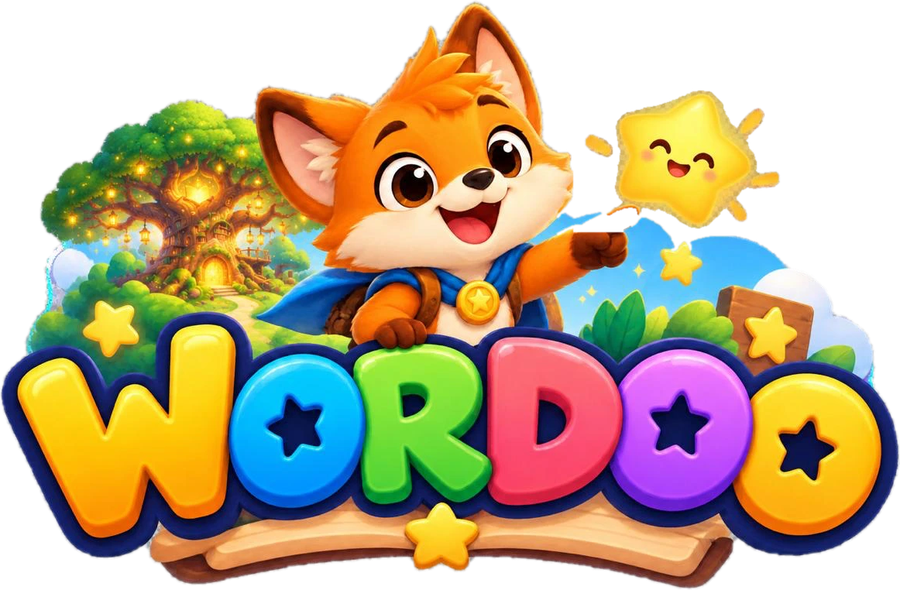
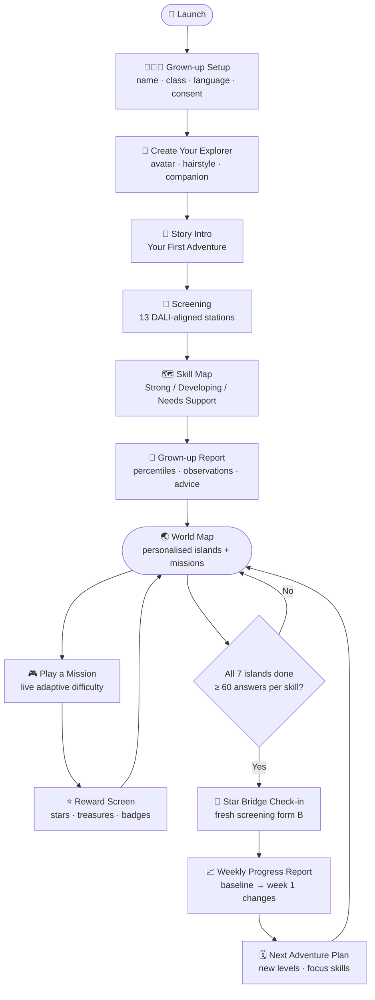
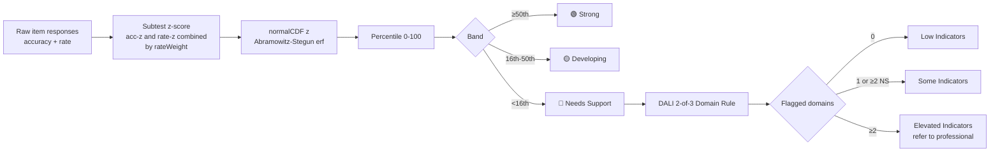

<div align="center">



# ✨ Wordoo — A Reading Adventure Just for You

**A story-driven, multilingual literacy companion for children aged 5–10.**  
*Assess → Understand → Personalise → Play → Measure → Grow*

[](https://flutter.dev)
[](https://dart.dev)
[](#16-how-to-run-it)
[](#22-credits-and-licences)
[](#17-tests)
[](#3-the-screening-test-dali-aligned)

> ⚠️ **Wordoo is an educational screening and practice tool. It is NOT a medical or clinical diagnostic tool.**  
> It never says a child "has dyslexia", never shows a "dyslexia probability", and always recommends  
> talking to a teacher or qualified professional when difficulties persist.

---

*"Help Milo the fox rescue the Story Keepers and restore the light of Aksharpur!"*

</div>

---

## 🗺️ Table of Contents

| # | Chapter | Description |
|---|---------|-------------|
| 1 | [🦊 The Idea in Plain Words](#1-the-idea-in-plain-words) | What Wordoo is and why it is different |
| 2 | [🚀 The Full User Journey](#2-the-full-user-journey-screens) | Every screen, from launch to weekly report |
| 3 | [🔬 The Screening Test](#3-the-screening-test-dali-aligned) | DALI-aligned 13-activity battery |
| 4 | [🎙️ VoxLexi — Speech Scoring](#4-speech-scoring--the-voxlexi-pipeline-on-the-phone) | How the phone scores reading aloud |
| 5 | [📊 Scoring & the Report](#5-scoring-rules-and-the-screening-report) | Z-scores, percentiles, DALI domain rule |
| 6 | [🧠 Personalisation & Adaptive Difficulty](#6-personalisation-and-adaptive-difficulty) | How Wordoo learns and adapts to each child |
| 7 | [🎮 The 11-Game Architecture](#7-the-11-game-architecture-and-the-6-playable-games) | Six playable games and five more coming |
| 8 | [⭐ Rewards](#8-rewards) | Stars, treasures, badges, and the Star Observatory |
| 9 | [📅 Weekly Cycle & Parent Report](#9-weekly-cycle-parent-report-and-next-week-plan) | Check-ins, growth reports, and the next plan |
| 10 | [🌐 Languages & Content](#10-languages-and-content-architecture) | English, Hindi, and the language-pack system |
| 11 | [🎨 Visual Design System](#11-visual-design-system) | Painted scenes, characters, and components |
| 12 | [🔒 Accessibility, Privacy & Safety](#12-accessibility-privacy-and-safety) | What is stored, what is never stored |
| 13 | [⚙️ Technical Architecture](#13-technical-architecture) | Flutter stack, state, offline-first design |
| 14 | [📁 Project Structure](#14-project-structure) | Full directory map |
| 15 | [💾 Data Model & Persistence](#15-data-model-and-persistence) | What is saved and how |
| 16 | [🛠️ How to Run It](#16-how-to-run-it) | Chrome, Android, tests |
| 17 | [🧪 Tests](#17-tests) | 34 tests and what they cover |
| 18 | [🎬 Demo Script for Judges](#18-demo-script-for-judges) | Step-by-step walkthrough |
| 19 | [📚 Research Basis](#19-research-basis--what-we-took-and-what-we-changed) | DALI, LexiScreen, VoxLexi |
| 20 | [🏗️ Project History](#20-what-we-built-step-by-step-project-history) | What was built and in what order |
| 21 | [🚧 Limitations & Roadmap](#21-known-limitations-and-roadmap) | Honest gaps and what comes next |
| 22 | [🙏 Credits & Licences](#22-credits-and-licences) | Fonts, research, third-party acknowledgements |

---

## 1. 🦊 The Idea in Plain Words

Most reading apps give every child **the same game**. Wordoo is different.

It first **understands how each child reads**, then builds a **personal learning journey** that keeps adapting every single answer. No daily limits. No one-size-fits-all.

```
ASSESS  →  UNDERSTAND  →  PERSONALISE  →  PLAY  →  MEASURE  →  RE-PERSONALISE  →  (repeat)
```

- 🧒 **The child** experiences a story adventure — *"Help Milo the Fox rescue the Story Keepers from Gumsum's cloud cages!"*
- 👨‍👩‍👧 **The parent/teacher** sees a clear, non-clinical skill report: what is strong, what needs practice, what changed week-on-week.
- 🤖 **The system** decides *what* to practise, *how hard* it should be, *which game* to play, *when* to make it easier or harder, and *what the next week* should look like.

Two children with different skill profiles get **different maps, different missions, and different starting levels** — automatically.

📘 Full game design: [GAME_DESIGN.md](GAME_DESIGN.md) · [GAME_DESIGN_V3.md](GAME_DESIGN_V3.md)

---

## 2. 🚀 The Full User Journey (Screens)



| # | Screen | What happens | Code |
|---|--------|--------------|------|
| 1 | **Launch** | Painted fantasy scene with castle, mountains, winding path, light rays, drifting clouds · *Let's Start* button | `screens/landing.dart` |
| 2 | **Grown-up setup** (4 steps) | ① Child nickname, age, class, language ② Privacy + consent (voice recording consent explicitly here) ③ Background questions (home language, school medium, vision/hearing, speech delay, family history) ④ How it works | `screens/onboarding.dart` |
| 3 | **Create your explorer** | Hairstyle, outfit, companion (fox / panda / dragon), explorer name | `screens/avatar_creator.dart` |
| 4 | **Your First Adventure** | Story intro: the Story Keepers have been captured; a grown-up note explains this is a literacy screening | `screens/adventure.dart` |
| 5 | **Screening (bridge stations)** | 13 DALI-aligned activities as game stations; bridge planks fill as the child progresses | `screening/ui/screening_screen.dart` |
| 6 | **Skill Map** | Parchment scroll with 6 skills (Strong / Developing / Needs Support), screening indicator, *Personalising your world…* | `screens/skill_map.dart` |
| 7 | **Screening report** | Indicator, 8 skill percentiles, DALI domains, strengths, skills to practise, observations, educator detail table, disclaimer | `screening/ui/report_screen.dart` |
| 8 | **World map** | Painted islands, one per skill; weakest skills get bigger islands; numbered daily missions; dotted trail | `screens/world_map.dart` |
| 9 | **Games** | Mission card → demo → 5 items with live difficulty changes → reward | `screens/game_screen.dart` |
| 10 | **Rewards** | *"You Did It!"* with sun rays, chest, stars, XP, treasures, badges | `widgets/reward_modal.dart` |
| 11 | **Customise & collect** | Treasures unlocked by stars, wearable hats, badges, *Your Room* | `screens/collection.dart` |
| 12 | **Weekly check-in** | Same screening with **form B** (completely fresh items), framed as *"Rebuild the Cloud Bridge"* | same screening code |
| 13 | **Parent progress report** | Baseline → week 1 per skill, overall change, practice consistency, common slips | `screens/reports.dart` |
| 14 | **Next adventure plan** | Focus skills for next week + suggested missions + new starting levels | `screens/reports.dart` |
| 15 | **Continuous learning loop** | Animated loop: Assess → Personalise → Play → Measure → Re-personalise | `screens/loop_screen.dart` |
| — | **Grown-up dashboard** | Profile, levels per skill, practice, slips, day-by-day plan, settings, demo controls (behind a simple arithmetic gate) | `screens/reports.dart` |

---

## 3. 🔬 The Screening Test (DALI-aligned)

> Wordoo does not use DALI's proprietary items or norms. All screening items are original, written by the Wordoo team using published DALI construct blueprints. Reference values are provisional estimates and must be replaced by pilot norms.

### 3.1 What We Measure

The constructs come from **DALI (Dyslexia Assessment for Languages of India)** by NBRC / UNESCO MGIEP, which groups tests into three domains: **phonological processing**, **literacy**, and **semantic retrieval / oral language**, plus processing automaticity (rapid naming).

| DALI Domain | Wordoo Construct | Used in Games? |
|---|---|---|
| Phonological processing | **Phonological Awareness** | ✅ Sound Forest |
| Phonological processing | *Rapid Naming Speed* (supporting) | Report only |
| Literacy | **Letter–Sound Knowledge** (grapheme–phoneme) | ✅ Symbol Valley |
| Literacy | **Decoding** (new / made-up words) | ✅ Word Ocean |
| Literacy | **Word Reading** (word recognition) | ✅ Word Village |
| Literacy | **Spelling / Writing** | ✅ Treasure Island |
| Literacy | **Reading Comprehension & Fluency** | ✅ Story Castle |
| Semantic retrieval | *Oral Language* (supporting) | Report only |

### 3.2 The Battery (13 Activities)

Two age bands, like DALI's JST / MST: **Junior = Class 1–2 (and pre-school)**, **Middle = Class 3–5**.

| # | Child Sees | Measures | Task | Junior | Middle | Voice? |
|---|---|---|---|---|---|---|
| 1 | 🎵 **Rhyme Time** | Rhyme recognition | Hear a word, tap the rhyming picture | 5 | 5 | – |
| 2 | 🔎 **Sound Detective** | Initial sound | Hear a sound, tap the picture starting with it | 5 | – | – |
| 3 | 🪄 **Sound Magic** | Phoneme / syllable deletion & replacement | *"Say cat without /k/"* — answers are heard, so reading is not needed | 4 | 6 | – |
| 4 | 🏹 **Letter Archer** | Letter / akshara–sound | Hear a sound, tap the letter (Hindi: matras, conjuncts) | 6 | 6 | – |
| 5 | 🖼️ **Picture Talk** | Expressive vocabulary | Name the picture aloud | 6 | 6 | 🎤 |
| 6 | ⚡ **Speedy Namer** | Rapid automatised naming | Name a 20-picture grid as fast as possible | 1 grid | 1 grid | 🎤 |
| 7 | 📜 **Read the Magic Words** | Word reading | Read graded words aloud | 8 | 10 | 🎤 |
| 8 | 👽 **Silly Alien Words** | Decoding | Read made-up words aloud | 6 | 8 | 🎤 |
| 9 | 🗺️ **Fix the Pirate Map** | Spelling / dictation | Hear a word, build it with letter / akshara-matra tiles | 5 | 6 | – |
| 10 | 👂 **Story Time** | Listening comprehension | Hear a story, answer 3 picture questions | 1 story | 1 story | – |
| 11 | 📖 **Read the Magic Scroll** | Reading comprehension | Junior: sentence → picture. Middle: passage → 3 questions | 3 | 1 passage | – |
| 12 | 🗣️ **Read to Milo** | Oral reading fluency | Read a short passage aloud; words-correct-per-minute | 1 | 1 | 🎤 |
| 13 | 🦁 **Animal Parade** | Semantic fluency | Say as many animals (form B: foods) as possible in 60 s | 1 | 1 | 🎤 |

**Design rules:**
- **Language:** the whole screening runs in the language chosen at setup (English or Hindi). Hindi content is written for Hindi — not translated.
- **Stop rule:** each activity stops after **3 misses in a row** (remaining items scored 0), so a struggling child is never stuck.
- **Fresh items:** screening items are tagged by form; check-ins pick the **least-used items first**. Games never repeat screening items.
- **Neutral feedback:** during screening the child hears *"Nice!"* / *"Great reading!"*, never right/wrong.
- **Duration:** about **15 minutes**, split into stations with a story wrapper.

### 3.3 Background Questionnaire

Asked once in setup and used **only to interpret results** (DALI emphasises language exposure):
home language, school medium, years in school, vision checked, hearing checked, speech delay, family history of reading difficulty.

> *Example:* if the test language is neither the home language nor the school medium, the report notes that lower scores may reflect less exposure, not a learning difficulty.

---

## 4. 🎙️ Speech Scoring — the VoxLexi Pipeline on the Phone

There is **no grown-up scoring**. Reading-aloud activities are scored entirely by the device, using an on-device port of the VoxLexi analysis code.

```
child speaks
    │
    ▼
Android SpeechRecognizer (Google speech services; en-IN / hi-IN)  ← speech_to_text plugin
    │  transcript + alternate transcripts + confidence
    │  sound-level stream (dB, ~every 50–100 ms)
    ▼
VoxLexi (Dart port)                                               ← lib/screening/voxlexi.dart
    ├─ pause detection from the sound-level stream
    │     noise floor = 20th percentile
    │     threshold = floor + max(1.5, 0.35 · (p90 − floor))
    │     pause = quiet gap ≥ 300 ms between speech onset and offset
    ├─ reading duration, response latency (mic open → first speech)
    ├─ fuzzy + phonetic word matching (Levenshtein distance)
    │     English:  ph→f, ck→k, c→k/s, ee/ea→i …
    │     Hindi:    nukta removed, chandrabindu ≈ anusvara
    ├─ word-sequence alignment (correct / wrong / missing / inserted)
    ├─ fluency risk = 0.6·time + 0.2·pause-frequency + 0.2·pause-duration
    │     expected time from grade norms, not a fixed 120–150 wpm
    ├─ rapid-naming accuracy (aligns spoken names to the grid) + names/second
    └─ category counting for fluency (unique animals / foods per language)
    ▼
item score (1 / 0.5 / 0) + rate + error tag  →  scorer
```

| Item Type | Full Credit | Half Credit |
|---|---|---|
| Real words, picture names | similarity ≥ 0.85 | ≥ 0.60 |
| Made-up words | phonetic similarity ≥ 0.75 | ≥ 0.50 |

Long speaking turns (rapid naming, passage reading, 60-second fluency) keep listening across recogniser restarts until the child taps **Done** or time runs out. If nothing is heard the child gets one retry, then the item is tagged *No response*.

If speech is not available (no voice consent, no recogniser, or web), voice activities are marked **"not measured"** — the app **never guesses**.

---

## 5. 📊 Scoring Rules and the Screening Report

All logic is in `lib/screening/scorer.dart`; reference values are in `lib/screening/battery.dart`.



1. **Subtest score** = accuracy (and, for timed tasks, a rate: names/sec, WCPM, number of animals).
2. **z-score** against **provisional** grade-band reference values (mean / SD per activity, per band). Timed tasks combine accuracy z and rate z (e.g. rapid naming: 30% accuracy weight / 70% speed weight).
3. **Percentile** = normal CDF of z. **Bands:** Strong ≥ 50th · Developing 16th–50th · Needs Support < 16th.
4. **Construct** percentile = mean z of its subtests → converted to a single percentile.
5. **DALI domain rule:** a domain is flagged when **≥ 50% of its measured subtests are Needs Support**.
6. **Overall indicator:**
   - 0 flagged domains → **Low indicators**
   - 1 flagged domain (or ≥ 2 constructs Needs Support) → **Some indicators**
   - ≥ 2 flagged domains → **Elevated indicators** → recommend a full assessment by a qualified professional (e.g. DALI-DAB or NIMHANS SLD battery)

The **report** contains: indicator + advice, 8 skill bars with percentile and band (icon + text, never colour alone), DALI domain flags, strengths, skills to practise first, automatic observations (e.g. *"Familiar words were read much better than made-up words"*, *"Read aloud at about 42 words correct per minute (typical: about 65)"*, *"Understood the story well when listening, but less when reading"*, most common spelling slip, exposure notes), an educator detail table (accuracy, rate, band per activity), and a disclaimer.

---

## 6. 🧠 Personalisation and Adaptive Difficulty

> **v2 game system (current):** The screening percentile sets a **starting step 1–7 of 10 per skill** (`Cfg.startStepTable`). A per-skill **learner model** (`engine/skill_model.dart`, Elo / IRT-style θ) updates after **every answer** and serves the step with ~78% expected success. Error tags that repeat become practice targets and fade over time. The **Quest Board** always offers 3 quests. The check-in unlocks **only after all seven islands** are played through, with ≥ 60 answers per skill and settled levels. There are no timers and no override.
>
> The table below describes the original v1 thresholds, kept for history.

All thresholds live in **`lib/core/config.dart`** (`Cfg`) — nothing is hard-coded in the UI.

| Setting | Value |
|---|---|
| Increase difficulty when recent accuracy ≥ | **90%** |
| Keep difficulty when recent accuracy ≥ | **60%** (below → step down + scaffolding) |
| Recent window / minimum attempts | 8 / 4 |
| Live (in-round) level-up / level-down | 2 correct in a row / 2 misses in a row |
| Difficulty levels | 1–4 |
| Starting level | Strong → 3 · Developing → 2 · Needs Support → 1 |
| Skill bands (percentile) | Strong ≥ 50 · Developing ≥ 16 |
| Items per game round · missions per day · days per week | 5 · 3 · 7 |

**How it works** (`lib/engine/personalizer.dart`, `lib/state/app_state.dart`):

- **Screening → skill scores:** each construct's percentile becomes that skill's score and sets its **independent** starting level. Error tags from the screening (e.g. *Wrong matra*, *Incorrect blend*) are carried into the skill's error history.
- **Live adaptation inside a game:** two correct in a row → *Power up!* (level +1); two misses → a friendly warm-up item (level −1) and **scaffolding** (a hint appears, one wrong option is removed, or the first spelling tile is pre-placed).
- **End-of-round rule:** recent-accuracy window (≥ 90% up, ≥ 60% stay, < 60% down + scaffold).
- **Priority:** `(100 − score) + errors × 0.8 + recent misses × 1.2` — weak skills with repeated errors come first.
- **Daily plan (~10 min, 3 missions):** weakest skill every day, the 2nd/3rd weakest alternating, and a rotating slot so strong skills keep progressing.
- **Map personalisation:** weaker skills get bigger, highlighted islands; strong skills get a ✨ "advanced" look.

---

## 7. 🎮 The 11-Game Architecture and the 6 Playable Games

Each skill **owns** its games; no game is the primary game for two skills (`lib/data/skills.dart`).

| Skill | Island | Games (★ = playable now) |
|---|---|---|
| Phonological Awareness | 🌲 Sound Forest | ★ **Sound Orchestra**, Sound Ninja |
| Grapheme–Phoneme | 🏹 Symbol Valley | ★ **Letter Archer**, Sound Portal |
| Decoding | 🌊 Word Ocean | ★ **Word Rocket**, Word Builder |
| Word Recognition | 🏘️ Word Village | ★ **Word Detective**, Word Flash |
| Spelling / Writing | 💛 Treasure Island | ★ **Spelling Hive**, Magic Writer |
| Comprehension | 🏰 Story Castle | ★ **Story Quest** |

Every game follows: **short explanation → automatic demonstration → 5 items → immediate gentle feedback → reward → progress update → back to the map.**

Mistakes say *"Almost! Let's try again."* — never "Wrong" or "Game over".

| Game | Mechanic | Difficulty 1 → 4 |
|---|---|---|
| **Sound Orchestra** | Hear a word, pick the picture with the same first sound / rhyme / blended word / sound deleted | first sound → rhyme → blending → deletion |
| **Letter Archer** | Hear a sound, shoot the matching letter target (arrow animation) | simple letters → look-alikes (b/d, ब/व) → digraphs / matras → rare patterns / conjuncts |
| **Word Rocket** | Tap sound units (each speaks), pick the word they make; rocket moves with progress | CVC → blends → 2 syllables → made-up words |
| **Word Detective** | Hear a word, find it among look-alikes; gentle timer | different words → same start → visual confusions |
| **Spelling Hive** | Hear a word, build it with letter / akshara-matra tiles on a parchment map | short words → digraphs → longer → longer with close distractors |
| **Story Quest** | Short illustrated story + question | detail → cause/effect → prediction → inference |

Items are generated from language-pack word lists (`lib/engine/item_factory.dart`), with pool tags so practice **never repeats screening items**.

---

## 8. ⭐ Rewards

- **1–3 stars** per round (effort always earns at least 1) + XP display; +3 bonus when the day's missions are done; +5 for each screening.
- **10 collectible treasures** unlocked by star totals (hats you can wear, friends, room decorations, gear).
- **Badges:** First Adventure, per-region Explorer, Daily Adventurer, Week Champion, Level Climber.
- The **Star Observatory** (7th island) unlocks when all six skill chapters are done; finishing it (plus enough answers per skill) opens the **Star Bridge** check-in.
- **No loot boxes, no lives, no leaderboards, no streak punishment.**

---

## 9. 📅 Weekly Cycle, Parent Report and Next-Week Plan

1. **Play (no time limit):** the Quest Board always offers 3 quests; each game has 4 levels shown as tiles on the island sheet; the second game unlocks after 2 levels of the main game.
2. **After all seven islands** (6 chapters + Star Observatory, ≥ 60 answers per skill, settled levels): *"The Star Bridge has appeared!"* → fresh screening with form B.
3. **Weekly report:** baseline → week-1 per skill, band changes, overall change, practice days / minutes / games, common slips, *What we observed*, support note.
4. **Next adventure plan:** focus skills (with reasons such as *"Improved strongly — a lighter touch this week"*), suggested missions, new starting levels.
5. **Learning loop** screen, then week 2 starts with a fresh plan.

> **Demo controls** (grown-up dashboard): load Profile A (Aarav) / Profile B (Meera). There is no time-skipping and no retest override; then open screening and check-in reports, the learning loop, or reset.

---

## 10. 🌐 Languages and Content Architecture

The engine never contains words, letters, prompts or stories — those live in **language packs**.

| Layer | English | Hindi | Where |
|---|---|---|---|
| Game content pack (`LangPack`): words with sound units, graphemes, made-up words, deletions, stories, prompts, spelling rules | ✅ | ✅ (akshara/matra-aware distractors, matra error tagging) | `lib/data/content_en.dart`, `content_hi.dart`, `lang.dart` |
| Screening bank (`ScreenBank`): all 13 activities, forms A/B, both age bands, fluency lexicons | ✅ | ✅ | `lib/screening/bank_en.dart`, `bank_hi.dart` |
| UI strings | ✅ | ✅ (child-facing lines) | `lib/data/strings.dart` |
| Speech | `en-IN` TTS / `en_IN` recognition | `hi-IN` / `hi_IN` | packs + `core/tts.dart` |

Kannada is registered as *coming soon* to show how a new language plugs in: add a `LangPack` and a `ScreenBank` — **no engine changes needed**.

Fonts: **Fredoka** (rounded game font) and **Noto Sans Devanagari** are bundled so Hindi renders fully offline.

---

## 11. 🎨 Visual Design System

Everything is drawn in code (no third-party image assets beyond the bundled art library), styled after the project's reference board.

- **Painted scenes** (`widgets/hero.dart`, `widgets/art.dart`): launch landscape with castle, mountains, tree lines, winding path, light rays, drifting clouds, twinkling sparkles; themed backgrounds per region (forest, ocean, valley, village, treasure, castle, citadel).
- **Props library** (`widgets/props.dart`): pine and round trees, palm, treasure chest, houses, castle, mountains, sailboat, fish, archery target, rocket, satellite, book, bushes, flowers, clouds, sparkles — used to paint **floating islands** (`IslandArt`).
- **Characters:** Milo the Fox with shading, sparkly eyes, cheek tufts, tail wag and blinking; the child explorer avatar with 4 hairstyles × 4 outfits and wearable hats; 7 Story Keepers (Bhalu, Arya, Kachhua, Ullu, Madhu, Pari, Dadi); Gumsum the storm cloud (multiple moods) and 6 Hush Cloud jailers.
- **Components** (`widgets/common.dart`): glossy 3-D buttons with a pressed "lip", panels, speech bubbles, star chip, power pips, progress bars, entrance animations.
- **Typography:** Fredoka via font variations; outlined titles (*"You Did It!"*, logo).
- **Mobile-first:** portrait-locked on phones; on laptops the app is shown inside a phone-shaped frame so the demo looks like the handset.

---

## 12. 🔒 Accessibility, Privacy and Safety

**Accessibility:**
- Large touch targets, short instructions, spoken prompts with replay buttons, high-contrast text with shadows, consistent layouts, no flashing.
- Settings: text size (normal / large / extra large), extra letter spacing, spoken instructions on/off, language.
- Skill status uses **icon + text + colour**, never colour alone.

**Privacy (strong by design):**
- **Data kept:** nickname, age/class, language, background answers, results — **on the device only** (`shared_preferences`).
- **Never asked:** phone number, location, photos, Aadhaar or any ID.
- **Audio is analysed live and not stored** — ever.
- Separate consent for voice recording; without it, voice activities are skipped and marked *not measured*.

**Language guardrails:**
- Output language is always "Strong / Developing / Needs Support", "skills to practise", "screening, not diagnosis".
- The app never says a child "has dyslexia" or shows a dyslexia probability.

---

## 13. ⚙️ Technical Architecture

```
┌────────────────────────── Flutter app (Dart) ──────────────────────────┐
│ UI: screens/ + screening/ui/ + widgets/   (AnimatedSwitcher shell)      │
│        │                                                               │
│ State: AppState (ChangeNotifier, provider)  ── persisted as JSON ──►   │
│        │                                       shared_preferences       │
│ Engines:                                                               │
│   screening/  battery · banks · scorer · voxlexi · speech_engine        │
│   engine/     item_factory · personalizer · report                      │
│ Content: data/ (LangPack EN/HI, skills, strings) · screening/bank_*     │
│ Device: speech_to_text (Android SpeechRecognizer) · flutter_tts         │
└─────────────────────────────────────────────────────────────────────────┘
```

| Item | Choice |
|---|---|
| Framework | Flutter 3.47 (Dart 3.13), Material 3 |
| State | `provider` + one `ChangeNotifier` (`AppState`) |
| Persistence | `shared_preferences` (single JSON document, key `wordoo_state_v1`) |
| Text-to-speech | `flutter_tts` (en-IN / hi-IN), failure-tolerant wrapper |
| Speech recognition | `speech_to_text` 7.x (Android SpeechRecognizer; Google speech services) |
| Graphics | `CustomPainter` vector art; rich `.webp` art library for backgrounds, characters, and islands |
| Backend | **None** — fully offline-capable, no API calls needed |
| Platforms | Android (tested on Vivo V2130, Android 14), Web (Chrome). iOS / macOS need Xcode. |

Android manifest adds `RECORD_AUDIO`, `INTERNET` (online recognition fallback) and `<queries>` for `RecognitionService` and `TTS_SERVICE`; app label **Wordoo**.

---

## 14. 📁 Project Structure

```
lib/
├── main.dart                     App entry, theme, text scaling, phone frame, portrait lock
├── core/
│   ├── config.dart               All tunable thresholds (Cfg)
│   ├── theme.dart                Colours, Fredoka text style, outlined text, shadows
│   ├── audio.dart                Audio player & SFX management
│   ├── frame_stats.dart          Performance monitoring
│   └── tts.dart                  Text-to-speech wrapper
├── data/
│   ├── skills.dart               6 skills, 11 games, regions, collectibles, badges, band labels
│   ├── lang.dart                 LangPack interface, pools A/B/P, language registry
│   ├── content_en.dart           English game content (770+ tagged words)
│   ├── content_hi.dart           Hindi game content (akshara/matra aware)
│   └── strings.dart              Brand + UI strings (en/hi)
├── models/models.dart            Skill, Band, Item, ItemResult, SkillState, Mission, AssessmentRecord, Avatar
├── engine/
│   ├── item_factory.dart         Generates game items for every skill × level × language
│   ├── personalizer.dart         Banding, starting levels, adaptation, priority, daily plan
│   └── report.dart               Weekly deltas, observations, error statistics
├── screening/
│   ├── models.dart               Construct, Domain, SItem, ItemResponse, SubtestResult, ScreeningReport, Background
│   ├── battery.dart              13 activity definitions + provisional reference values
│   ├── bank.dart / bank_en.dart / bank_hi.dart   Screening content (forms A/B, junior/middle)
│   ├── voxlexi.dart              On-device VoxLexi port (pauses, matching, alignment, fluency risk)
│   ├── speech_engine.dart        Speech recogniser wrapper (transcript, alternates, sound levels)
│   ├── scorer.dart               z-scores, percentiles, DALI domain rule, indicator, observations
│   ├── adaptive.dart             Adaptive question selection engine
│   ├── whisper_mapper.dart       Whisper transcript → scoring bridge
│   └── ui/
│       ├── screening_screen.dart Bridge-station flow, stop rule, report hand-off
│       ├── agent_banner.dart     Agent/character banner component
│       ├── tasks.dart            Choice, questions, tiles, read-aloud, rapid naming, oral reading, fluency tasks
│       └── report_screen.dart    Grown-up screening report
├── state/app_state.dart          Central state, persistence, screening → skills, games, rewards, weekly cycle, demo profiles
├── screens/                      landing, onboarding, avatar_creator, adventure, skill_map, world_map,
│                                 game_screen, collection, reports (dashboard / weekly / next plan),
│                                 loop_screen, parent_gate, app_shell, storm_trial
├── story/
│   ├── cutscene.dart             Story cutscene engine and scene definitions
│   └── puppets.dart              Character puppet animation system
└── widgets/                      art (characters, scenes, islands), hero (launch scene), props (vector props),
                                  common (buttons, panels, companion), item_views (game items),
                                  reward_modal, report_widgets, ambient

test/
├── engine_test.dart              Content validity, item generation, A/B separation, thresholds, A vs B plans
├── flow_test.dart                Adaptation, scaffolding, missions, rewards, weekly cycle, widgets, app boot
├── screening_test.dart           Screening content coverage, VoxLexi port, scoring rules, starting levels, flow smoke test
├── adaptive_screening_test.dart  Adaptive question selection tests
├── cutscene_content_test.dart    Cutscene scene content validation
├── whisper_test.dart             Whisper integration smoke tests
├── hindi_demo_test.dart          Hindi demo flow tests
└── v3_keys_test.dart             v3 keys and progression tests

assets/
├── art/                          Backgrounds, characters, islands, props, story illustrations (.webp)
├── sfx/                          Sound effects (.ogg)
├── vo/en/ and vo/hi/             Voice-over audio clips (.ogg)
├── music/                        Background music tracks (.ogg)
└── fonts/                        Fredoka.ttf, NotoSansDevanagari.ttf (SIL OFL)

tool/
├── build_scenes.py               Cutscene build tool
├── gen_voices.py                 Voice-over generation tool
├── gen_sfx.py                    SFX generation tool
└── export_bank.dart              Screening bank export utility

server/
└── src/                          Node.js server (agent.js, gemini.js, whisper.js, store.js, subtests.js)
```

About **10,000+ lines of Dart** in total.

---

## 15. 💾 Data Model and Persistence

Everything is stored in **one JSON document** in `shared_preferences` (browser `localStorage` on web), so a refresh or app restart keeps the demo state perfectly intact.

| Stored | Details |
|---|---|
| Profile | nickname, explorer name, age, class, language, consent, avatar (hair, outfit, companion, hat) |
| Background | home language, school medium, years in school, vision/hearing checked, speech delay, family history, voice consent |
| Screenings | every `ScreeningReport` (constructs, subtests, domains, indicator, observations, form, minutes) |
| Skills | per skill: baseline score, current score, level, recent outcomes, error tags, sessions, scaffold flag |
| History | assessment records per week (scores, simulated flag) |
| Practice | current day, missions, practice days, minutes, sessions this week |
| Rewards | stars, badges, unlocked treasures |
| Settings | text size, spacing, voice, contrast |

---

## 16. 🛠️ How to Run It

### Prerequisites
- Flutter 3.47+ (`brew install --cask flutter` on macOS)
- For Android: Android SDK / platform tools, a phone with **USB debugging** on
- At least ~5 GB free disk space for Android builds

### Run in Chrome (Quickest)
```bash
cd ~/code/wordoo && ./run.sh
```
> Voice activities are marked *not measured* on web — this is expected behaviour.

### Run on an Android Phone over USB
```bash
cd ~/code/wordoo && flutter run -d <device-id>
```
Find the device id with `flutter devices`. Or build and install manually:
```bash
flutter build apk --debug
adb install -r build/app/outputs/flutter-apk/app-debug.apk
```
On first use, tick the **voice-recording consent** in setup and tap **Allow** when Android asks for the microphone. For better Hindi recognition, install Hindi offline speech in the phone's Google speech-services settings.

### Run the Tests
```bash
flutter test
```

---

## 17. 🧪 Tests

`flutter test` runs **34 tests**, all passing, including a simulated child playing a full cycle (7 islands → check-in → new season), the word database, the item generator at every step, the learner model and the retest gate.

<details>
<summary><strong>What the tests cover (click to expand)</strong></summary>

- **Content:** every word's sound units rebuild the word (EN + HI); every screening activity has enough items for both forms, both age bands and both languages; forms A and B never overlap; spelling answers match targets; no duplicate options.
- **Generators:** items for every skill × level × form × language are valid.
- **VoxLexi port:** fuzzy/phonetic matching (e.g. "fab" accepted for made-up word "fap", chandrabindu ≈ anusvara), passage alignment, pause detection on a synthetic sound-level stream, fluency risk ordering, category counting, rapid-naming alignment.
- **Scoring:** strong performance → *Low indicators*; weak performance across domains → *Elevated* with referral advice; no speech → *not measured* (never guessed); screening sets independent starting levels.
- **Engine & flow:** Profile A vs B get different missions/levels; difficulty rises on success and falls with scaffolding; live in-round changes are kept; missions/rewards/day completion; full weekly cycle; gentle wrong-answer feedback; Hindi spelling build; screening first station; app boots.

</details>

---

## 18. 🎬 Demo Script for Judges

1. Launch → **Let's Start** → on setup step 1 tap **Aarav · Profile A** (or **Meera · Profile B**) for an instant profile — or complete setup and play the real screening.
2. Show the **Skill Map** and *"Personalising your world…"*, then the **world map**: weak skills = big glowing islands, numbered missions.
3. Play a mission (e.g. **Spelling Hive**). Make two mistakes on purpose → hint + warm-up level; get two right → *Power up!* Finish → *"You Did It!"*
4. Open the **grown-up dashboard** (arithmetic gate) → show independent levels per skill and the day-by-day plan.
5. Show the **Quest Board** and the **retest checklist** in the dashboard: the check-in opens only after all seven islands are played. Switch between Profile A and B to show different starting steps per skill.
6. Switch to the other demo profile to show a completely different map and plan.

---

## 19. 📚 Research Basis — What We Took and What We Changed

| Source | What We Used | What We Deliberately Changed |
|---|---|---|
| **DALI / DALI-DAB** (NBRC, UNESCO MGIEP; *Annals of Dyslexia* 2021) | The constructs (rhyme, phoneme/syllable replacement, letter/akshara identification, word and nonword reading, spelling, reading and listening comprehension, picture naming, semantic fluency, rapid naming), the three domains, the "2 of 3 domains" rule, junior vs middle tools, attention to language exposure | DALI items and norms are licensed and not public, so **all items are original** and reference values are **provisional**; we test in **one chosen language** (DALI's bilingual comparison is therefore not possible and the report says so); output is a screening indicator, never a diagnosis |
| **LexiScreen** (linisha19/idp) | Audio-first child-friendly flashcards, Indian-English voice, replay counting and response time, randomised anti-repetition item bank with balanced difficulty, reading-comfort ideas, careful "indication" wording | Multi-format tasks (speaking, building, listening) instead of mostly MCQ; per-skill profiles instead of one overall percentage |
| **VoxLexi** (madadivinayasri-lab/VoxLexi) | Words → sentences → paragraph reading, pause detection, duration vs expected, weighted fluency-risk formula, word-sequence comparison | Runs **on the phone** with the device recogniser instead of Whisper on a server; expected speed from **grade norms** (not 120–150 wpm); fuzzy + phonetic matching; **no "dyslexia probability"** and no model trained on unknown data |
| Akshara Path product specification | Six literacy parameters, 11-game system, independent difficulty, weekly fresh reassessment, error-aware personalisation, offline-first, privacy and safety language | Implemented as a working prototype |

**Key references:**
- [DALI-DAB development and standardisation (Annals of Dyslexia, 2021)](https://link.springer.com/doi/10.1007/s11881-021-00227-z) · [PubMed 33909225](https://pubmed.ncbi.nlm.nih.gov/33909225/)
- [UNESCO MGIEP — DALI](https://mgiep.unesco.org/article/dyslexia-assessment-for-languages-of-india-dali)
- [Sahu et al., 2022 — Curriculum-based vs skill-based assessment (APJDD)](https://das.org.sg/wp-content/uploads/2023/10/APJDD-V9-1-2022-SMITA.pdf)
- [LexiScreen repository](https://github.com/linisha19/idp) · [VoxLexi repository](https://github.com/madadivinayasri-lab/VoxLexi)

---

## 20. 🏗️ What We Built, Step by Step (Project History)

<details>
<summary><strong>Full build history (click to expand)</strong></summary>

**0. (Latest) Long-term game system v3 — Story Keepers rescue narrative:**
- *The Rescue of the Story Keepers* narrative with Gumsum as the villain, 6 Hush Cloud jailers, cloud cages, and keys as progress currency.
- Storm Citadel (7th island) and Storm Trial finale.
- Rich `.webp` art library: island art, character expressions, jailers, cages, villain moods, redeemed Gumsum.
- Voice-over audio system with ElevenLabs-generated `.ogg` clips for all major dialogue moments.
- Cutscene engine and puppet animation system.
- Whisper mapper bridge for speech scoring.
- Adaptive screening engine.
- Node.js server for Gemini/Whisper cloud integration (optional).

**0. (Previous) Long-term game system v2:**
- Removed the daily cap and weekly retest.
- Per-skill learner model (Elo/IRT-style θ).
- Screening sets each skill's starting step.
- Quest Board, chapters, tiers, and seasons.
- Star Observatory as the 7th island.
- Evidence-based check-in gate.
- Feature-tagged English word database (770+ words).
- Cycle-based reports.

1. **Product study** — read the Akshara Path specification (six parameters, 11 games, weekly reassessment, privacy, offline-first) and the visual reference board.
2. **First Flutter prototype** — project setup, data model, English + Hindi language packs, item generator for all six skills, rule-based personalisation engine, central state with persistence, onboarding, avatar creator, hidden "bridge" assessment, skill map, world map, six playable games with live adaptive difficulty, rewards and collection, weekly report, next-week plan, learning loop, grown-up dashboard, demo profiles A/B, 14 tests.
3. **Mobile-first UI overhaul** — matched the reference board: painted launch scene, glossy 3-D buttons, rounded Fredoka font, painted islands with props, mission-card HUD, parchment puzzle boards, sunburst reward screen, scroll-style skill map, shaded characters, phone frame for laptop demos, portrait lock.
4. **Screening research** — studied DALI, LexiScreen and VoxLexi; wrote the screening implementation plan.
5. **Screening implementation** — DALI-aligned 13-activity battery (EN + HI), forms A/B, junior/middle bands, background questionnaire and voice consent, on-device VoxLexi speech pipeline, scoring engine with provisional norms and DALI domain rule, grown-up screening report, screening → independent starting levels, weekly check-in.
6. **On-device testing** — built and installed on a Vivo V2130 (Android 14) over USB, confirmed Google speech-recognition service, fixed dashboard layout.

</details>

---

## 21. 🚧 Known Limitations and Roadmap

### Honest Limitations

| Area | Limitation |
|---|---|
| **Norms** | Reference values are **provisional estimates** — real norms need a pilot (≈ 30–50 children per class and language) |
| **Speech recognition** | Recognisers tend to turn made-up words into real words; phonetic matching reduces but does not eliminate this. Children's accents also reduce accuracy. |
| **Hindi recognition** | Quality depends on the phone's Google speech-services language pack being installed |
| **Games** | Only 6 of the 11 games are fully playable; Kannada is a placeholder |
| **Backend** | No accounts or teacher dashboard yet; iOS build not set up (needs Xcode) |

### Roadmap

- 🔬 **Pilot study** → replace provisional norms; reliability (target α > 0.8) and validity against DALI / teacher ratings.
- 🌐 **Optional dual-language screening** (DALI's bilingual rule).
- 🎙️ **On-device Whisper-style recogniser** for better made-up-word scoring; offline-first speech models.
- 🎮 **Remaining 5 games** (Sound Ninja, Sound Portal, Word Builder, Word Flash, Magic Writer).
- 🌍 **More Indian languages**, larger story libraries, teacher/class dashboard, PDF export of reports.
- 📱 **iOS build** setup and App Store submission.

---

## 22. 🙏 Credits and Licences

- **Fonts:** Fredoka and Noto Sans Devanagari — [SIL Open Font License 1.1](https://scripts.sil.org/OFL).
- **All illustrations** are original artwork created specifically for Wordoo.
- **DALI** is developed by the National Brain Research Centre (NBRC), India, with UNESCO MGIEP. Wordoo is **not affiliated** with DALI and does not use its proprietary items or norms.
- **LexiScreen** and **VoxLexi** are third-party open repositories used only as design inspiration; no code was copied — the VoxLexi analysis steps were re-implemented in Dart.

---

<div align="center">

*Made with ❤️ for every child who deserves a reading adventure of their own.*

**Wordoo** · Flutter · DALI-aligned · Offline-first · Privacy-by-design

</div>
